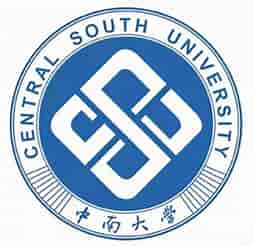

Hi! I am Lei Hu (胡磊), the third year Ph.D. candidate of Cell Biology Lab (细胞生物学实验室) at [School of Life Sciences](https://sls.westlake.edu.cn/en/), [Westlake University](https://en.westlake.edu.cn/) (西湖大学生命科学学院), advised by chair professor [Hongtao Yu](https://en.westlake.edu.cn/faculty/hongtao-yu.html). I am also the Ph.D. student of [Artificial Intelligence and Computational Biology (AICB) Lab (人工智能与计算生物学实验室)](https://aicb.lab.westlake.edu.cn/) at the Department of Artificial Intelligence, [School of Engineering](https://en-soe.westlake.edu.cn/) (西湖大学工学院人工智能系), co-advised by professor [Jianyang Zeng](https://en.westlake.edu.cn/faculty/jianyang-zeng.html). Additionally, I am actively collaborating with assistant professor [Sai Zhang](https://sai-zhang.com/) at [Yale University](https://medicine.yale.edu/biomedical-informatics-data-science/) and assistant professor [Han Li](https://lihan97.github.io/) at [Nankai University](http://en.math.nankai.edu.cn/).

Previously, I received B.E. in Automation and B.S. in Biotechnology from [University of Science and Technology Beijing](http://en.ustb.edu.cn/) (北京科技大学高等工程师学院/化学与生物工程学院). I also studied at [Central South University](https://en.csu.edu.cn//) (中南大学自动化学院) as an exchange student.

My main research interest focus on **AI for Life Sciences**, supported by National Natural Science Foundation Basic Research Grants Program for Doctoral Students (国家自然科学基金青年学生基础研究项目(博士研究生)) and Doctoral Student Program of the Young S&T Talents Cultivation Project, CAST (中国科协青年科技人才培育工程博士生专项计划).

## 💬 Recent News
  * *March,* *2026*. Congratulations to Sheng Mao on being admitted to the **Ph.D. program at Stanford University**.
  * *December,* *2025*. I am honored to be supported by **Doctoral Student Program of the Young S&T Talents Cultivation Project, CAST (中国科协青年科技人才培育工程博士生专项计划).**
  * *June,* *2025*. Ph.D. student → Ph.D. candidate.
  * *December,* *2024*. I am honored to be supported by **National Natural Science Foundation Basic Research Grants Program for Doctoral Students (国家自然科学基金青年学生基础研究项目(博士研究生)).**
  * *October,* *2024*. I am honored to receive the **National Scholarship.**
  * *September,* *2024*. Congratulations! My collaborator, Peng Liu has been admitted to **Department of Automation, Tsinghua University.**
  * *Jun,* *2024*. [OmicVerse: A Framework for Bridging and Deepening Insights Across Bulk and Single-Cell Sequencing](https://www.nature.com/articles/s41467-024-50194-3) accepted to **Nature Communications.**

## 📝 Recent Publications and Important Manuscripts (*: co-first author)

<ol class="publication-list">
  <li>[1]<strong>Hu L*</strong>, Zhang S*, Zhang X*, et al. (2025). <strong>STARNet enables spatially resolved inference of gene regulatory networks from spatial multi-omics data</strong>. <em>Nature Methods in review</em>.</li>
  <li>[2]Zeng Z*, Ma Y*, <strong>Hu L*</strong>, et al. (2024). <strong>OmicVerse: a framework for bridging and deepening insights across bulk and single-cell sequencing</strong>. <em>Nature Communications</em>, Vol. 15, Issue 1, pp. 5983.</li>
  <li>[3]Xing C*, Zeng Z*, <strong>Hu L*</strong>, et al. (2025). <strong>scLTNN: an innovative tool for automatically visualizing single-cell trajectories</strong>. <em>Bioinformatics Advances</em>, Vol. 5, Issue 1, pp. vbaf033.</li>
  <li>[4]<strong>Hu L*</strong>, Zhang X*, Liu P*, et al. <strong>ScRNA-seq and Spatial Transcriptome of Gastric Mucosa Discovers the Immune Suppressive Mechanisms in Helicobacter Pylori Infection</strong>. (Submitted)</li>
  <li>[5]Zhao Y*, Liu P*, <strong>Hu L*</strong>, et al. (2023). <strong>Chromatin and Gene Regulatory Dynamics of Optic Nerve Invasion in Retinoblastoma at Single-Cell Resolution</strong>. <em>bioRxiv</em>, pp. 2023.05.10.540147.</li>
  <li>[6]Ji Y, Jiang J, <strong>Hu L</strong>, et al. <strong>Targeting necrotic lipid release in tumors enhances immunosurveillance and cancer immunotherapy of glioblastoma</strong>. (Cell Research in review)</li>
  <li>[7]Wu Y, Zhang T, Zhou H, Wu H, Sunchu H, <strong>Hu L</strong>, et al. (2024). <strong>DeepCRE: Transforming Drug R&amp;D via AI-Driven Cross-drug Response Evaluation</strong>. <em>arXiv preprint arXiv:2403.03768</em>.</li>
</ol>

## 📖 Education
  &emsp; [Westlake University](https://www.westlake.edu.cn/)                           
  &emsp; Ph.D. student in Biology, School of Life Sciences, advised by Prof. [Hongtao Yu](https://en.westlake.edu.cn/faculty/hongtao-yu.html) and Prof. [Jianyang Zeng](https://en.westlake.edu.cn/faculty/jianyang-zeng.html). 2023.08 - Present

  &emsp; [University of Science and Technology Beijing](http://en.ustb.edu.cn/) （GPA: 3.76/4.0）      
  &emsp; B.E. in Automation, [School of Advanced Engineering](https://gcsxy.ustb.edu.cn/), advised by Ph.D. Student [Zehua Zeng](https://github.com/Starlitnightly) at [112lab](https://112lab.asia/people) and Associate Professor [Rongbin Li](https://metall.ustb.edu.cn/szdw/jsjs/83d7b380b378434f83e47d12040d40c4.htm). 2019.09-2023.06

  &emsp; [University of Science and Technology Beijing](http://en.ustb.edu.cn/)    
  &emsp; B.S. in Biotechnology, School of Chem. and Bio. Engineering. 2020.09-2023.06

  &emsp; [Central South University](https://en.csu.edu.cn//) （GPA: 4.0/4.0）   
  &emsp; Exchange Student, School of Automation, 2021.09-2022.01

## 👑 Awards and Honors
  + 2025: Outstanding Graduate Student Award, Exploration Award, Westlake University
  + 2025: Doctoral Student Program of the Young S&T Talents Cultivation Project, CAST (中国科协青年科技人才培育工程博士生专项计划)
  + 2025: Outstanding Youth League Members of Hangzhou Education Bureau System (杭州市教育系统优秀共青团员)
  + 2024: National Natural Science Foundation Basic Research Grants Program for Doctoral Students (国家自然科学基金青年学生基础研究项目(博士研究生))
  + 2024: National Scholarship, Ministry of Education
  + 2024: Innovation Awards, Westlake University
  + 2023: Dean Award, School of Advanced Engineering, USTB (Top Award of Undergraduate Students)
  + 2023: "San Hao" Graduate, USTB
  + 2023: Outstanding Graduation Thesis of USTB
  + 2022: Zhongtian Steel Scholarship, USTB
  + 2022: Huawei Intelligent Base Scholarship, USTB
  + 2021: Tongda Scholarship (1/146), USTB
  + 2021: Outstanding "San Hao" Student, USTB
  + 2020: People Scholarship (First Class), USTB

## 🎤 Talks
  + [Inferring Spatial Gene Regulatory Networks from Multi-Omics Data](https://mp.weixin.qq.com/s/1lGVbU2clciPbuP_BLlPaw), College of Future Technology, Peking University, November 2025.
  + Spatiotemporal Mapping of Gene Regulatory Networks using Spatial Multi-omics Data, Systems and Synthetic Biology Program ECR Seminar, School of Life Sciences, Westlake University, June 2025.
  + [New functions and progress of OmicVerse, the python based framework for transcriptome data analysis](https://mp.weixin.qq.com/s/JX0BKKMCkBkDO-JRq7lKpA), BiolinkX, Zhejiang University, September 2024.
  + [OmicVerse - Introduction to the python based framework for transcriptome data analysis](https://mp.weixin.qq.com/s/PHE8vePsRMs9HouJTGsf9Q), BiolinkX, Online, September 2023.

## 💻 Internships
  * 2023.03 - 2023.07 Research Intern at [AIR](https://air.tsinghua.edu.cn/), Tsinghua University, advised by Prof. [Zaiqing Nie](https://air.tsinghua.edu.cn/info/1046/1203.htm) and Postdoc [Yushuai Wu](https://air.tsinghua.edu.cn/airtd/bsh.htm).
  * 2021.11 - 2023.08 Research Intern at [112Lab](https://112lab.asia/people), University of Science and Techonology Beijing, advised by Ph.D. Student [Zehua Zeng](https://github.com/Starlitnightly).
  * 2021.07 - 2022.07 Research Intern at [APM](http://www.apm.cas.cn), Chinese Academy of Science, advised by Prof. [Fuchun Lin](https://people.ucas.edu.cn/~linfuchun). 
  * 2020.09 - 2021.09 Research Intern at [Metall](https://metall.ustb.edu.cn/), University of Science and Techonology Beijing, advised by Associate Professor [Rongbin Li](https://metall.ustb.edu.cn/szdw/jsjs/83d7b380b378434f83e47d12040d40c4.htm). 

## 🔗 Co-working Students
(*I am working with some visiting/undergraduate/doctoral students and postdocs at Westlake University with chair professor Hongtao Yu and professor Jianyang Zeng*)
  * Peng Liu (undergraduate student at USTB → master student at THU)
  * Yihan Zhao (undergraduate student at USTB → master student at FDU)
  * Zheming Zhang (undergraduate student at CSU → master student at CSSC)
  * Fenglei Zhang (undergraduate student at SXU → Ph.D. student at NPU)
  * [Zhaorui Jiang](https://zhaorui-bi.github.io/) (undergraduate student at OUC → master student at PKU)
  * [Peiran Lin](https://ljzylinpr.github.io/) (undergraduate student at SDU → Ph.D. student at Westlake University)
  * Haoteng Gu (undergraduate student at BJUT)
  * [Xuting Zhang](https://lxzcpro.github.io/) (undergraduate student at Westlake University)
  * [Sheng Mao](https://chrismao0325.github.io/) (undergraduate student at Westlake University → incoming Ph.D. student at Stanford University)
  * Zedong Jiao (master student at XTU)
  * Yuntian Shi (undergraduate student at Westlake University)
  * Zimu Lin (undergraduate student at Westlake University)
  * Zimo Zhang (undergraduate student at Westlake University)
  * Aoxin Wan (undergraduate student at Westlake University)
  * Yongji Lv (undergraduate student at Westlake University)  
  * Bowen Guo (8-years M.D. student at Westlake University and Southern Medical University)  

## 🤗 Academic Service
  * Reviewer, ISMB 2026
  * Editor assistant, Protein Cell

