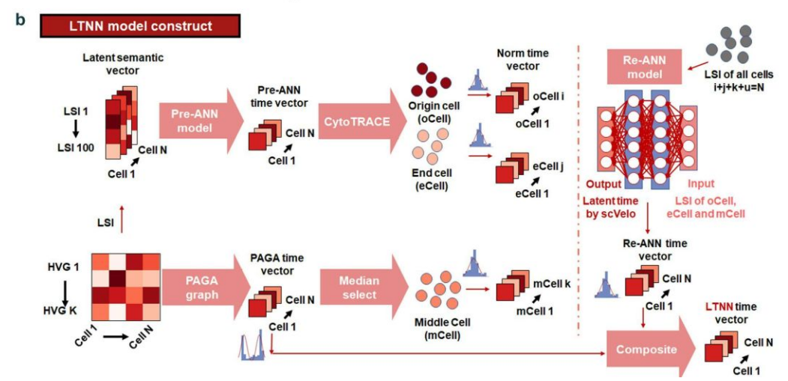

Hi! I am Lei Hu (胡磊), the third year Ph.D. candidate of Cell Biology Lab (细胞生物学实验室) at [School of Life Sciences](https://sls.westlake.edu.cn/en/), [Westlake University](https://en.westlake.edu.cn/) (西湖大学生命科学学院), advised by chair professor [Hongtao Yu](https://en.westlake.edu.cn/faculty/hongtao-yu.html). I am also the Ph.D. student of [Artificial Intelligence and Computational Biology (AICB) Lab (人工智能与计算生物学实验室)](https://aicb.lab.westlake.edu.cn/) at the Department of Artificial Intelligence, [School of Engineering](https://en-soe.westlake.edu.cn/) (西湖大学工学院人工智能系), co-advised by professor [Jianyang Zeng](https://en.westlake.edu.cn/faculty/jianyang-zeng.html). 

Previously, I received B.E. in Automation and B.S. in Biotechnology from [University of Science and Technology Beijing](http://en.ustb.edu.cn/) (北京科技大学高等工程师学院/化学与生物工程学院). I also studied at [Central South University](https://en.csu.edu.cn//) (中南大学自动化学院) as an exchange student.

My main research interest focus on **AI for Life Sciences**, supported by National Natural Science Foundation Basic Research Grants Program for Doctoral Students (国家自然科学基金青年学生基础研究项目(博士研究生)) and Doctoral Student Special Program of the CAST Young Science and Technology Talents Cultivation Project (中国科协青年科技人才培育工程博士生专项计划).

## 💬 Recent News
  * *December,* *2025*. I am honored to be supported by **Doctoral Student Special Program of the CAST Young Science and Technology Talents Cultivation Project (中国科协青年科技人才培育工程博士生专项计划).**
  * *June,* *2025*. Ph.D. student → Ph.D. candidate.
  * *December,* *2024*. I am honored to be supported by **National Natural Science Foundation Basic Research Grants Program for Doctoral Students (国家自然科学基金青年学生基础研究项目(博士研究生)).**
  * *October,* *2024*. I am honored to receive the **National Scholarship !**
  * *September,* *2024*. Congratulations! My collaborator, Peng Liu has been admitted to **Department of Automation, Tsinghua University !**
  * *Jun,* *2024*. [OmicVerse: A Framework for Bridging and Deepening Insights Across Bulk and Single-Cell Sequencing](https://www.nature.com/articles/s41467-024-50194-3) accepted to **Nature Communications !**

## 📠Recent Publications and Important Manuscripts (†: co-first author)

BioRxiv

[STARNet enables spatially resolved inference of gene regulatory networks from spatial multi-omics data](https://www.biorxiv.org/content/10.1101/2025.08.21.671434v2) **Lei Hu†**, Shichen Zhang†, Xuting Zhang†, Yihai Luo†, Haoteng Gu, Peng Liu, Sheng Mao, Li Chen, Yuhao Xia, Minghao Yang, Sai Zhang, Yaosen Min, Han Li, Peizhuo Wang, Hongtao Yu✉, Jianyang Zeng✉. *<b>BioRxiv (In Revision in Nature Research Journal)</b>*, 2025.08 21.671434 (2025). 

<a href="https://www.biorxiv.org/content/10.1101/2025.08.21.671434v2">Biorxiv</a> 

 <a href="https://starnet-tutorials.readthedocs.io/en/latest">Tutorials</a> 

Nature Communications

[OmicVerse: A Framework for Bridging and Deepening Insights Across Bulk and Single-Cell Sequencing](https://www.nature.com/articles/s41467-024-50194-3) Zehua Zeng†,✉, Yuqing Ma†, <b>Lei Hu†</b>, Bowen Tan, Peng Liu, Yixuan Wang, Cencan Xing✉, Yuanyan Xiong✉, Hongwu Du✉. *<b>Nature Communications</b>*, 15, 5983 (2024). 

<a href="https://www.nature.com/articles/s41467-024-50194-3">Paper</a>, <a href="https://doi.org/10.1101/2023.06.06.543913">Biorxiv</a> 

<a href="https://github.com/Starlitnightly/omicverse">Code</a>, <a href="https://github.com/Starlitnightly/omicverse-reproducibility">Reproducibility</a>, <a href="https://starlitnightly.github.io/omicverse/">Tutorials</a> 

Bioinformatics Advances

[scLTNN: an innovative tool for automatically visualizing single-cell trajectories](https://academic.oup.com/bioinformaticsadvances/advance-article/doi/10.1093/bioadv/vbaf033/8043205) Cengcan Xing†, Zehua Zeng†,✉, <b>Lei Hu†</b>, Jianing Kang, Shah Roshan, Yuanyan Xiong✉, Hongwu Du✉, Tongbiao Zhao✉. *<b>Bioinformatics Advances</b>*, vbaf033 (2025). 

<a href="https://academic.oup.com/bioinformaticsadvances/advance-article/doi/10.1093/bioadv/vbaf033/8043205">Paper</a>, <a href="https://doi.org/10.1101/2022.09.28.510020">Biorxiv</a> 

<a href="https://github.com/Starlitnightly/scLTNN">Code</a>, <a href="https://scltnn.readthedocs.io/en/latest/index.html">Tutorials</a> 

Cell Research

[Targeting necrotic lipid release in tumors enhances immunosurveillance and cancer immunotherapy of glioblastoma](https://www.nature.com/articles/s41422-025-01155-y) Yapeng Ji, Junyao Jiang, <b>Lei Hu</b>, Peng Lin, Mingshan Zhou, Song Hu, Minkai Wang, Yuchen Ji, Xianzhi Liu, Dongming Yan, Yang Guo, Adwait Amod Sathe, Bret M. Evers, Chao Xing, Xuelian Luo, Qi Xie, Weike Pei, Zhenyu Zhang✉, Hongtao Yu✉. *<b>Cell Research</b>*, (2025). 

<a href="https://www.nature.com/articles/s41422-025-01155-y">Paper</a> 

In peer review

ProMeta: A meta-learning framework for robust disease diagnosis and prediction from plasma proteomics. Han Li†,✉, Haoteng Gu†, <b>Lei Hu†<b>, Zimo Zhang, Yongji Lv, Peng Gao, Johnathan Cooper-Knock, Yaosen Min✉, Jianyang Zeng✉, Sai Zhang✉. (2025). 

<a href="https://www.nature.com/articles/s41422-025-01155-y">Paper</a> 

## 📖 Education
  &emsp; [Westlake University](https://www.westlake.edu.cn/)                           
  &emsp; Ph.D. student in Biology, School of Life Sciences, advised by Prof. [Hongtao Yu](https://en.westlake.edu.cn/faculty/hongtao-yu.html) and Prof. [Jianyang Zeng](https://en.westlake.edu.cn/faculty/jianyang-zeng.html). 2023.08 - Present

  &emsp; [University of Science and Technology Beijing](http://en.ustb.edu.cn/) （GPA: 3.76/4.0）      
  &emsp; B.E. in Automation, [School of Advanced Engineering](https://gcsxy.ustb.edu.cn/), advised by Ph.D. Student [Zehua Zeng](https://github.com/Starlitnightly) at [112lab](https://112lab.asia/people) and Associate Professor [Rongbin Li](https://metall.ustb.edu.cn/szdw/jsjs/83d7b380b378434f83e47d12040d40c4.htm). 2019.09-2023.06

  &emsp; [University of Science and Technology Beijing](http://en.ustb.edu.cn/)    
  &emsp; B.S. in Biotechnology, School of Chem. and Bio. Engineering. 2020.09-2023.06

  &emsp; [Central South University](https://en.csu.edu.cn//) （GPA: 4.0/4.0）   
  &emsp; Exchange Student, School of Automation, 2021.09-2022.01

## 👑 Awards and Honors
  + 2025: Doctoral Student Special Program of the 2025 CAST Young Science and Technology Talents Cultivation Project (中国科协青年科技人才培育工程博士生专项计划)
  + 2025: Outstanding Youth League Members of Hangzhou Education Bureau System (杭州市教育系统优秀共青团员)
  + 2024: National Natural Science Foundation Basic Research Grants Program for Doctoral Students (国家自然科学基金青年学生基础研究项目(博士研究生))
  + 2024: National Scholarship, Ministry of Education
  + 2024: Innovation Awards, Westlake University
  + 2023: Dean Award, School of Advanced Engineering, USTB (Top Award of Undergraduate Students)
  + 2023: "San Hao" Graduate, USTB
  + 2023: Outstanding Graduation Thesis of USTB
  + 2022: Zhongtian Steel Scholarship, USTB
  + 2022: Huawei Intelligent Base Scholarship, USTB
  + 2021: Tongda Scholarship (1/146), USTB
  + 2021: Outstanding "San Hao" Student, USTB
  + 2020: People Scholarship (First Class), USTB

## 🎤 Talks
  + [Inferring Spatial Gene Regulatory Networks from Multi-Omics Data](https://mp.weixin.qq.com/s/1lGVbU2clciPbuP_BLlPaw), College of Future Technology, Peking University, November 2025.
  + Spatiotemporal Mapping of Gene Regulatory Networks using Spatial Multi-omics Data, Systems and Synthetic Biology Program ECR Seminar, School of Life Sciences, Westlake University, June 2025.
  + [New functions and progress of OmicVerse, the python based framework for transcriptome data analysis](https://mp.weixin.qq.com/s/JX0BKKMCkBkDO-JRq7lKpA), BiolinkX, Zhejiang University, September 2024.
  + [OmicVerse - Introduction to the python based framework for transcriptome data analysis](https://mp.weixin.qq.com/s/PHE8vePsRMs9HouJTGsf9Q), BiolinkX, Online, September 2023.

## 💻 Internships
  * 2023.03 - 2023.07 Research Intern at [AIR](https://air.tsinghua.edu.cn/), Tsinghua University, advised by Prof. [Zaiqing Nie](https://air.tsinghua.edu.cn/info/1046/1203.htm) and Postdoc [Yushuai Wu](https://air.tsinghua.edu.cn/airtd/bsh.htm).
  * 2021.11 - 2023.08 Research Intern at [112Lab](https://112lab.asia/people), University of Science and Techonology Beijing, advised by Ph.D. Student [Zehua Zeng](https://github.com/Starlitnightly).
  * 2021.07 - 2022.07 Research Intern at [APM](http://www.apm.cas.cn), Chinese Academy of Science, advised by Prof. [Fuchun Lin](https://people.ucas.edu.cn/~linfuchun). 
  * 2020.09 - 2021.09 Research Intern at [Metall](https://metall.ustb.edu.cn/), University of Science and Techonology Beijing, advised by Associate Professor [Rongbin Li](https://metall.ustb.edu.cn/szdw/jsjs/83d7b380b378434f83e47d12040d40c4.htm). 

## 🔗 Co-working Students
(*I am working with some visiting/undergraduate/doctoral students and postdocs at Westlake University with chair professor Hongtao Yu and professor Jianyang Zeng*)
  * Peng Liu (undergraduate student at USTB → master student at THU)
  * Yihan Zhao (undergraduate student at USTB → master student at FDU)
  * Zheming Zhang (undergraduate student at CSU → master student at CSSC)
  * Fenglei Zhang (undergraduate student at SXU → master student at NPU)
  * [Zhaorui Jiang](https://zhaorui-bi.github.io/) (undergraduate student at OUC → master student at PKU)
  * [Peiran Lin](https://ljzylinpr.github.io/) (undergraduate student at SDU → Ph.D. student at Westlake University)
  * Haoteng Gu (undergraduate student at BJUT)
  * [Xuting Zhang](https://lxzcpro.github.io/) (undergraduate student at Westlake University)
  * Sheng Mao (undergraduate student at Westlake University)
  * Zedong Jiao (master student at XTU)
  * Yuntian Shi (undergraduate student at Westlake University)
  * Zimu Lin (undergraduate student at Westlake University)
  * Zimo Zhang (undergraduate student at Westlake University)
  * Aoxin Wan (undergraduate student at Westlake University)
  * Yongji Lv (undergraduate student at Westlake University)  
  
