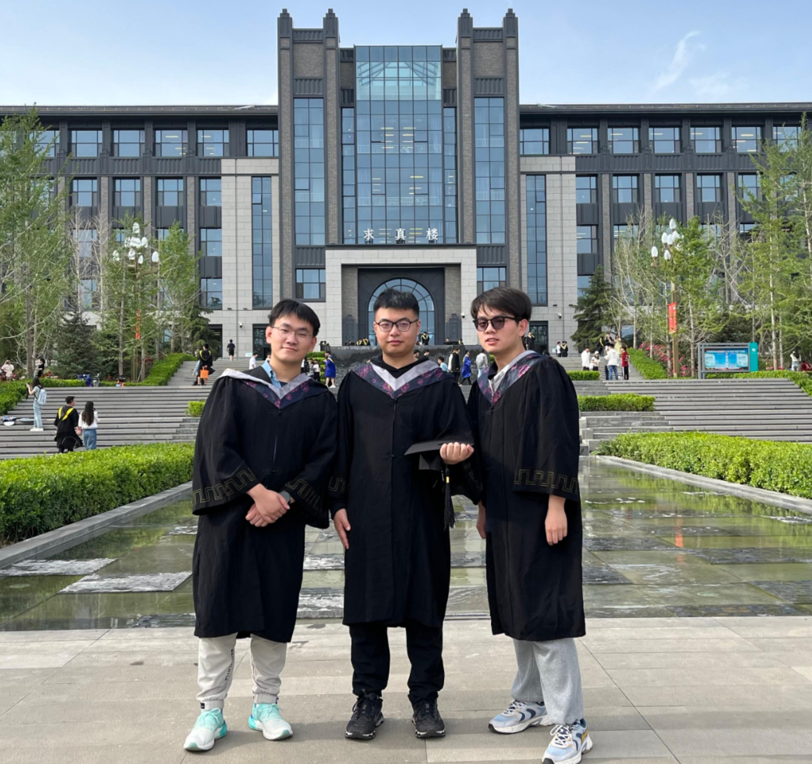
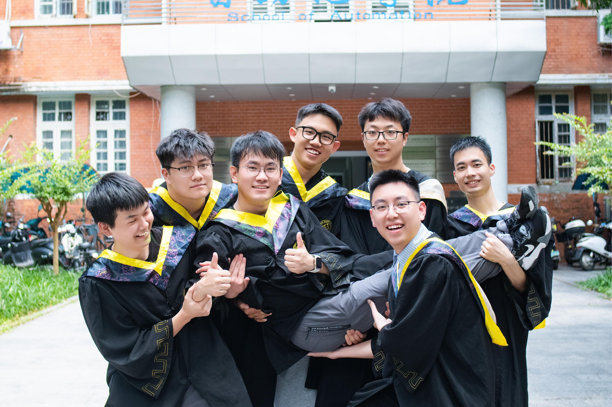
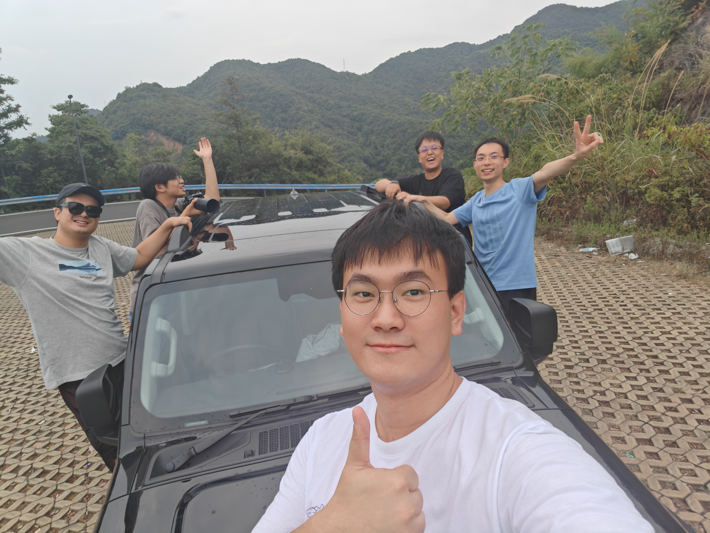

## 📷 Gallery Wall

<!-- filter Navigation -->

    <a href="#" class="filter-link active" id="filter-graduation" onclick="showTopic('graduation'); return false;">🎓 Graduation (USTB)</a>
    /
    <a href="#" class="filter-link" id="filter-graduationCSU" onclick="showTopic('graduationCSU'); return false;">🎓 Graduation (CSU)</a>
    /
    <a href="#" class="filter-link" id="filter-teaching" onclick="showTopic('teaching'); return false;">👨‍🏫 TA Experience</a>
    /
    <a href="#" class="filter-link" id="filter-friends" onclick="showTopic('friends'); return false;">👥 Friends</a>

<!-- Graduation Moments filter Content -->

USTB Graduation

📅: June, 2025 

🧑: Me and my friends of the same undergraduate laboratory (Peng Liu and Yihan Zhao) 

📍: University of Science and Technology Beijing, Beijing, China

USTB Graduation

📅: June, 2025 

🧑:  Me and my friend of the same undergraduate laboratory (Peng Liu) 

📍: University of Science and Technology Beijing, Beijing, China

USTB Graduation

📅: June, 2024 

🧑: Me and my friends of Class 2024 of School of Advanced Engineering 

📍: University of Science and Technology Beijing, Beijing, China

USTB Graduation

📅: June, 2024 

🧑: Me and my friends of the same undergraduate laboratory (Peng Liu and Yihan Zhao) 

📍: University of Science and Technology Beijing, Beijing, China

USTB Graduation

📅: June, 2024 

🧑: Me 

📍: University of Science and Technology Beijing, Beijing, China

USTB Graduation

📅: June, 2023 

🧑: The president of USTB and me  

📍: University of Science and Technology Beijing, Beijing, China

Shanxi University 2023

📅: June, 2023 

🧑: Me and my friends  

📍: Shanxi University, Taiyuan, Shanxi Province, China

<!-- GraduationCSU Moments filter Content -->

CSU Graduation

📅: June, 2025 

🧑: Me and my friends of the Class 2103 of Automation and Electrical Appliances (Central South University, School of Automation).  

📍: Central South University, Changsha, Hunan Province, China

CSU Graduation

📅: June, 2025 

🧑: Me and my friends of the Class 2103 of Automation and Electrical Appliances (Central South University, School of Automation).  

📍: Central South University, Changsha, Hunan Province, China

CSU Graduation

📅: June, 2025 

🧑: Me and my friend (Zheming Zhang).  

📍: Central South University, Changsha, Hunan Province, China

Westlake Friends 2024

📅: June, 2024 

🧑: Me and my friends (Peng Liu and Zhaorui Jiang).  

📍: Westlake University, Hangzhou, Zhejiang Province, China

<!-- Teaching Assistant Experience filter Content -->

PEBBLE Summer Campus 2024

📅: August, 2024 

🧑: Me (TA) and my friends of the PEBBLE summer campus  

📍: Huzhou, Zhejiang Province, China

PEBBLE Summer Campus 2024

📅: August, 2024 

🧑: Me (TA) and my friends of the PEBBLE summer campus  

📍: Westlake University, Hangzhou, Zhejiang Province, China

PEBBLE Summer Campus 2024

📅: August, 2024 

🧑: Me (TA) and my friends of the PEBBLE summer campus  

📍: Shaoxing, Zhejiang Province, China

PEBBLE Connections 2024

📅: August, 2024 

🧑: Me (TA) and my friends of the PEBBLE summer campus  

📍: Shaoxing, Zhejiang Province, China

<!-- Friends and Memories filter Content -->

CSU Class 2103

📅: January, 2022 

🧑: Me and my friends of the Class 2103 of Automation and Electrical Appliances (Central South University, School of Automation).  

📍: Central South University, Changsha, Hunan Province, China

Westlake Friends

📅: June, 2024 

🧑: Me and my friends (Peng Liu and Zhaorui Jiang).  

📍: Westlake University, Hangzhou, Zhejiang Province, China

<!-- Modal for photo viewing -->

  &times;
  

````
