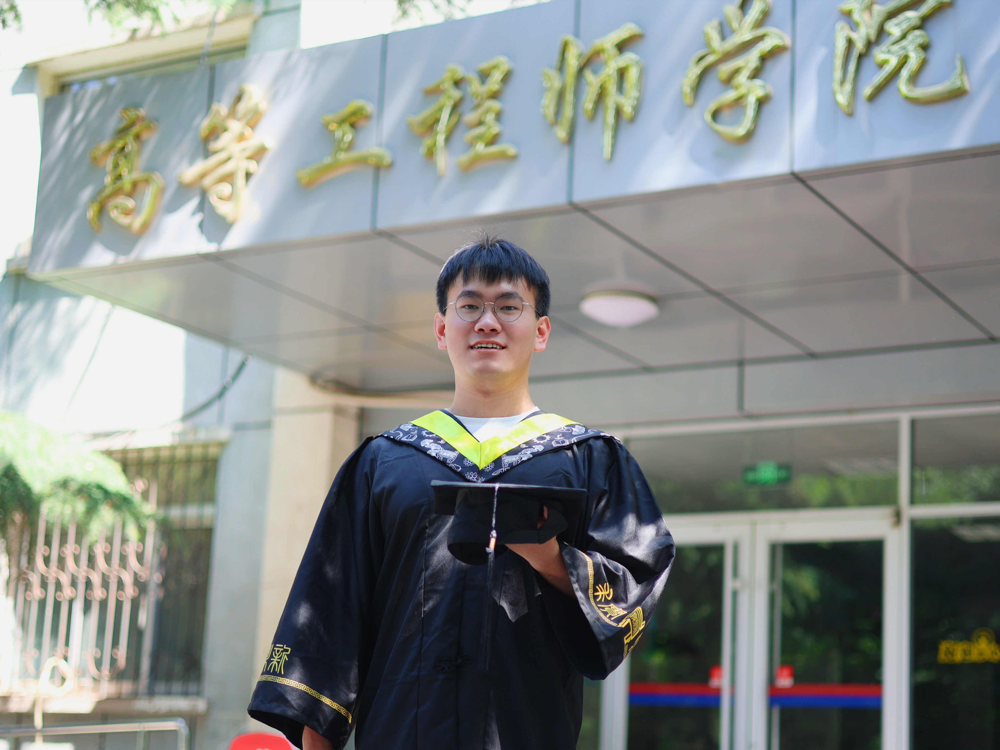

## 📷 Gallery Wall

### 🎓 Graduation Moments

USTB Graduation 2024

A memorable moment from my graduation ceremony at University of Science and Technology Beijing. This represents the culmination of years of hard work and dedication to my studies.

USTB Celebration 2024

Celebrating academic achievements with friends and classmates. These moments of shared joy and accomplishment are what make the academic journey truly special.

USTB Memories 2024

Capturing the joy of completing my studies at USTB. The graduation ceremony was a perfect conclusion to an important chapter of my academic life.

USTB Graduation 2023

An earlier graduation moment from my academic journey. Each graduation represents growth and new beginnings in my educational path.

SXU Campus 2023

Academic activities and memories from my time at SXU. The beautiful campus provided an inspiring environment for learning and research.

### 👨‍🏫 Teaching Assistant Experience

PEBBLE Summer Campus 2024

Teaching and mentoring students at the PEBBLE summer program in Hangzhou. This was an incredible opportunity to share knowledge and guide the next generation of researchers.

PEBBLE Teaching 2024

Engaging with students and sharing knowledge during the summer campus program. The interactive learning environment fostered great discussions and academic growth.

PEBBLE Collaboration 2024

Collaborative learning moments with participants from the summer school. Working together with students from diverse backgrounds enriched the teaching experience.

PEBBLE Connections 2024

Building connections with students and fellow teaching assistants. The program created lasting academic relationships and friendships.

### 👥 Friends and Memories

CSU Class 2103 2022

Cherished moments with classmates during my time at CSU. The bonds formed during university years create lifelong friendships and academic collaborations.

Westlake Friends 2024

Enjoying time with research colleagues and friends at Westlake University. These social moments provide balance to the rigorous academic life and foster collaborative relationships.

  &times;
  

