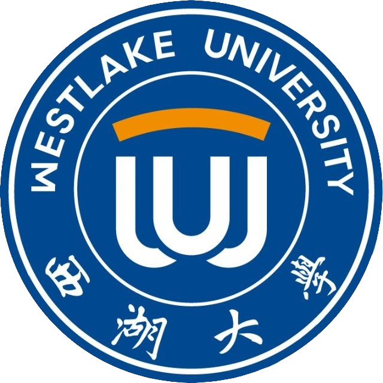
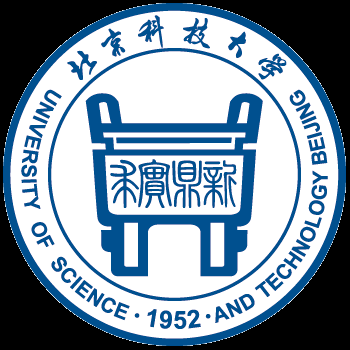
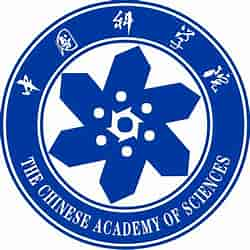

  <h2> Current</h2>
  <ul class="research-timeline">
    <li>
      

        
        <a href="https://www.westlake.edu.cn/" target="_blank">Westlake University</a>
      

      
Ph.D. Training, advised by Prof. <a href="https://en.westlake.edu.cn/faculty/jianyang-zeng.html" target="_blank">Jianyang Zeng</a>

      
2023.07 – Present

    </li>
    <li>
      

        <a href="https://www.westlake.edu.cn/" target="_blank">Westlake University</a>
      

      
Ph.D. Student Rotation Program and Training, advised by Prof. <a href="https://en.westlake.edu.cn/faculty/hongtao-yu.html" target="_blank">Hongtao Yu</a>

      
2023.11 – Present

    </li>
  </ul>

  <h2> Past Rotations & Internships</h2>
  <ul class="research-timeline">
    <li>
      

        <a href="https://www.westlake.edu.cn/" target="_blank">Westlake University</a>
      

      
Ph.D. Student Rotation Program, advised by Prof. <a href="https://www.westlake.edu.cn/faculty/jian-yang.html" target="_blank">Jian Yang</a>

      
2023.10 – 2023.11

    </li>
    <li>
      

        <a href="https://www.westlake.edu.cn/" target="_blank">Westlake University</a>
      

      
Ph.D. Student Rotation Program, advised by Prof. <a href="https://www.westlake.edu.cn/faculty/yanmei-dou.html" target="_blank">Yanmei Dou</a>

      
2023.09 – 2023.10

    </li>
    <li>
      

        
        <a href="https://www.tsinghua.edu.cn/" target="_blank">Tsinghua University</a>
      

      
Research Intern at <a href="https://air.tsinghua.edu.cn/" target="_blank">AIR</a>, advised by Prof. <a href="https://air.tsinghua.edu.cn/info/1046/1203.htm" target="_blank">Zaiqing Nie</a> and Postdoc <a href="https://air.tsinghua.edu.cn/airtd/bsh.htm" target="_blank">Yushuai Wu</a>

      
2023.03 – 2023.07

    </li>
    <li>
      

        
        <a href="http://en.ustb.edu.cn/" target="_blank">University of Science and Technology Beijing</a>
      

      
Research Intern at <a href="http://huasheng.ustb.edu.cn/" target="_blank">112Lab</a>, advised by Prof. <a href="http://huasheng.ustb.edu.cn/shiziduiwu/jiaoshixinxi/2020-06-10/244.html" target="_blank">Hongwu Du</a> and Ph.D. Student <a href="https://github.com/Starlitnightly" target="_blank">Zehua Zeng</a>

      
2021.11 – 2023.08

    </li>
    <li>
      

        
        <a href="http://www.apm.cas.cn" target="_blank">Chinese Academy of Sciences</a>
      

      
Research Intern at <a href="http://www.apm.cas.cn" target="_blank">APM</a>, advised by Prof. <a href="https://people.ucas.edu.cn/~linfuchun" target="_blank">Fuchun Lin</a>

      
2021.07 – 2022.07

    </li>
    <li>
      

        
        <a href="http://en.ustb.edu.cn/" target="_blank">University of Science and Technology Beijing</a>
      

      
Research Intern at <a href="https://metall.ustb.edu.cn/" target="_blank">Metall</a>, advised by Associate Professor <a href="https://metall.ustb.edu.cn/szdw/jsjs/83d7b380b378434f83e47d12040d40c4.htm" target="_blank">Rongbin Li</a>

      
2020.09 – 2021.09

    </li>
  </ul>

